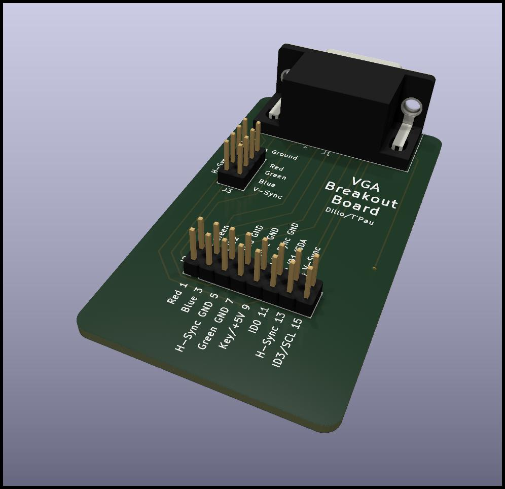

# Connector Breakout Boards

### Easy Access to Pins of Common Connectors for Prototyping or Testing

## What Are These Boards?

They provide easy access to each pin of a connector via a pin header, labeled with the pin number and its use. If a connector contains multiple ground pins, these can be connected on the board via jumpers.

## Why Use These Boards?

They make testing or prototyping cables easier by providing a robust connection and avoiding mixing up pins.

## Getting Started

You can produce these boards

## D-Sub 9, 15, and 25

These connectors saw a wide variety of uses, therefore only pin numbers are provided on the silk screen. Each breakout board contains a pins and a socket connector.

### D-Sub 9 Bill of Materials

Amount | Part 
-------|-----
1      | 90° D-Sub-9 pins
1      | 90° D-Sub-9 socket
1      | 2x5 pin header

### D-Sub 15 Bill of Materials

Amount | Part 
-------|-----
1      | 90° D-Sub-15 pins
1      | 90° D-Sub-15 socket
1      | 2x8 pin header

### D-Sub 25 Bill of Materials

Amount | Part 
-------|-----
1      | 90° D-Sub-25 plug
1      | 90° D-Sub-25 socket
1      | 2x13 pin header

## VGA Breakout Board

This board exposes each pin of a VGA connector on a pin header. It also allows connecting each of the GND pins via jumpers.

### Bill of Materials

Amount | Part 
-------|-----
1      | 90° D-Sub-15 HD socket
1      | 2x4 pin header
1      | 2x8 pin header
4      | jumper
